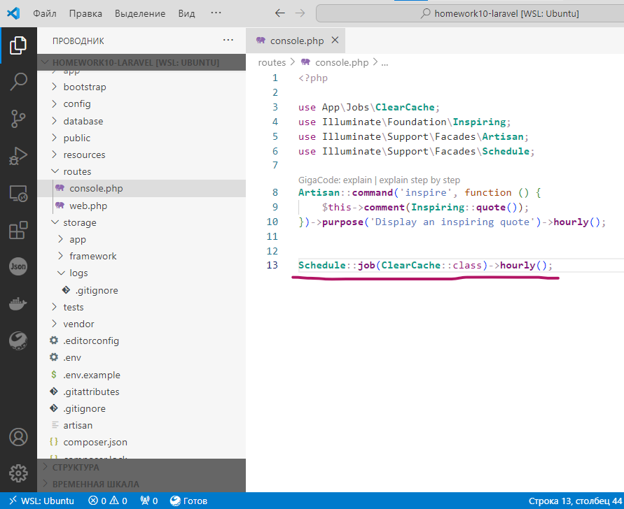
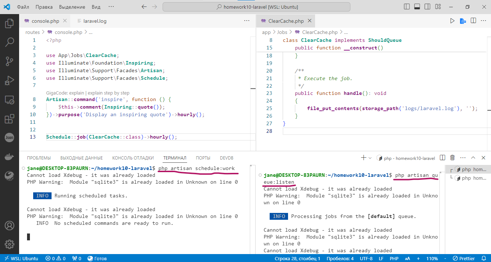
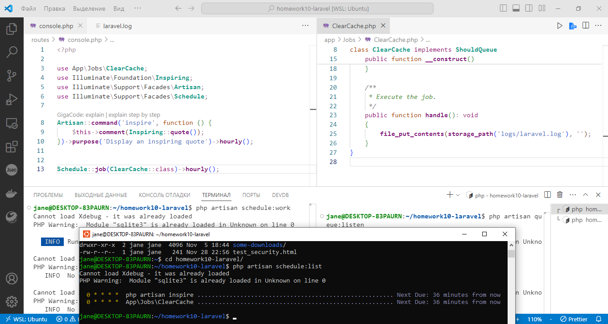

# Laravel. Homework 10. Тогочакова Евгения

В рамках практической работы вы реализуете очистку файла логирования приложения с помощью асинхронной задачи, помещенной в планировщик задач.

Что нужно сделать:

1. Создайте новый проект Laravel или откройте уже существующий.

2. Создайте новую ветку вашего репозитория от корневой (main или master).

3. Создайте миграцию для очереди через базу данных командой php artisan queue:table.

4. Выполните миграцию.

5. Пропишите в файле .env QUEUE_CONNECTION=database.

6. Создайте класс ClearCache.php с помощью команды php artisan make:job ClearCache.

7. В файле ClearCache.php пропишите код для очистки лог-файла.

8. Поместите вызов Job в планировщик задач Laravel в файле app/Console/Kernel.php.

9. Запустите очередь командой php artisan queue:listen.

10. Запустите планировщик задач командой php artisan schedule:work и не закрывайте терминал.

